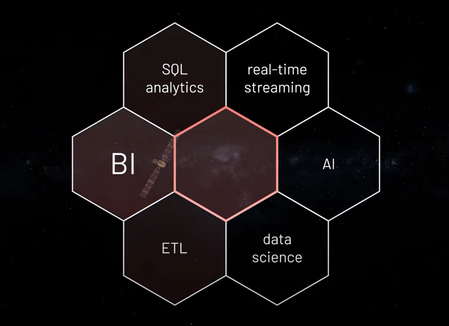

# Introduction to the databricks platform

# About Databricks + History

- Databricks is the Data + AI company.
- With origins in academia and the open-source community, the company was founded in 2013 by the original creators of Apache Spark™, Delta Lake and MLflow.
- Built on a modern Lakehouse architecture in the cloud, Databricks combines the best of data warehouses and data lakes to offer an open and unified platform for data and AI.
- Headquartered in San Francisco
- Databricks is on a mission to simplify and democratize data and AI, helping data teams solve the world’s toughest problems.

# Databricks platform

- "ONE PLACE FOR ALL YOUR DATA" - That is what they quote in their video
- "ONE Foundation for every workload"- From BI to AI

"ONE Platform that runs everywhere"

- One platform that brings everything together - "Lakehouse"

## Key aspects of databricks platform

- Collaborative notebooks - allowing DE & DS to work together
- Reliable Data Engineering -
- Production Machine Learning
- SQL Analytics on all your data

# Getting Started with Free trial

- Go to the following URL and register yourself [https://databricks.com/try-databricks](https://databricks.com/try-databricks)
- Select AWS environment
- You should get an email with steps to proceed.
- Which should lead you here on the panel to get started [https://accounts.cloud.databricks.com/#plans](https://accounts.cloud.databricks.com/#plans)
- Follow all the steps based on the tabs on left

- Select Standard Plan
- Add card for billing (Intention is to shut it down before my 14 day trial ends
- Connect to your AWS account (If you don't have one signup here [https://aws.amazon.com/free/](https://aws.amazon.com/free/))
- Add the following details from your AWS account

- AWS account ID
- AWS Access Key ID
- AWS Secret Access Key
- Create Bucket and add the right policies
- Then Click on Deploy! Voila it should take around 30 mins for the clusters to spinup, please note the clusters have a separate cost

# Positioning of databricks compared to AWS/GCP/AZURE

Comparitively databricks is positioning itself as a unified data platform

[https://www.quora.com/What-is-the-advantages-disadvantages-of-Databricks-vs-AWS-EMR-spark](https://www.quora.com/What-is-the-advantages-disadvantages-of-Databricks-vs-AWS-EMR-spark)

[https://towardsdatascience.com/dataiku-vs-alteryx-vs-sagemaker-vs-datarobot-vs-databricks-b3870bd34813](https://towardsdatascience.com/dataiku-vs-alteryx-vs-sagemaker-vs-datarobot-vs-databricks-b3870bd34813)

[https://stackshare.io/databricks/alternatives](https://stackshare.io/databricks/alternatives)

# Exploring Key Components of databricks

[https://docs.databricks.com/getting-started/concepts.html](https://docs.databricks.com/getting-started/concepts.html)

[Add screen shots]

**[Notebook](https://docs.databricks.com/notebooks/index.html)**

A web-based interface to documents that contain runnable commands, visualizations, and narrative text.

**[Dashboard](https://docs.databricks.com/notebooks/dashboards.html)**

An interface that provides organized access to visualizations.

**[Library](https://docs.databricks.com/libraries/index.html)**

A package of code available to the notebook or job running on your cluster. Databricks runtimes include many libraries and you can add your own.

**[Experiment](https://docs.databricks.com/applications/mlflow/tracking.html#mlflow-experiments)**

A collection of [MLflow runs](https://docs.databricks.com/applications/mlflow/tracking.html#mlflow-tracking) for training a machine learning model.

[https://towardsdatascience.com/single-node-and-distributed-deep-learning-on-databricks-2ab69797f812](https://towardsdatascience.com/single-node-and-distributed-deep-learning-on-databricks-2ab69797f812)

[https://www.youtube.com/watch?v=u0pSc3jSsIw](https://www.youtube.com/watch?v=u0pSc3jSsIw)

# Pricing of platform

Pricing is platform wise

Pay as you go pricing:

GCP Pricing: [https://databricks.com/product/gcp-pricing](https://databricks.com/product/gcp-pricing)

AWS Pricing: [https://databricks.com/product/aws-pricing](https://databricks.com/product/aws-pricing)

Free trial: [https://databricks.com/try-databricks](https://databricks.com/try-databricks)

Price for used AWS services is extra

Joining Email

## **Welcome to Databricks!**

Thank you for signing up for access to Databricks! We need you to verify your email address by following this [link](https://accounts.cloud.databricks.com/login?resetpassword&username=syal.anuj%40lynxanalytics.com&expiration=-60000&token=1cd55062cf4f18465c8c8cf41b786873f6fcb392#reset-password).

We'll walk you through the process of getting up and running with Databricks Premium Plan. For additional security, Databricks is set up within your own AWS account. Our setup wizard will guide you through the process of creating an IAM role or user with the requisite permissions for Databricks so that you can launch clusters in your AWS environment.

As you get started, you will need:

- Your own AWS account - this is where your clusters are launched.

**Get started by visiting**

:

<Link>

- The Databricks Team

# Conclusion

# What's next

Let's look at deploying a real life workflow