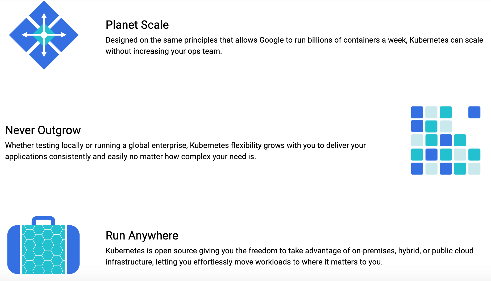

# Getting started with Kubernetes


### Part 1: Introduction

**What is Kubernetes?**

- Kubernetes is a software that allows us to deploy, manage and scale applications. The applications will be packed in containers and kubernetes groups them into units. It allows us to span our application over thousands of servers while looking like one single unit.
- Kubernetes is meant to work best for microservice architecture (wait for next section)
- Has now become a standard with all the top cloud providers having kubernetes  support

**Containers/Microservices?**

Containers -

- What is a container 'A standardized unit of software'
- A container is a standard unit of software that packages up code and all its dependencies so the application runs quickly and reliably from one computing environment to another.
- works anywhere mac windows, linux ubuntu
- consider container as packaged software like a disc image (dmg) which just works, it has everything installed and works, which can be pulled out and placed anywhere else like a shipping container - can be put on a ship, train, truck


- Before we start about containers lets see the history - how did we get to containers

**Microservices architecture** 


**Why Kubernets?**



- Kubernetes provides over 15 years of Google’s experience running production workloads at scale
- Main goal - ease of deployment scaling and mantainence
- Kubernetes provides you with a framework to run distributed systems resiliently. It takes care of scaling and failover for your application, provides deployment patterns, and more.
- Scalability
- With modern web services, users expect applications to be available 24/7, and developers expect to deploy new versions of those applications several times a day.

### Part 2: Important concepts of Kubernetes

**Kubernetes Cluster**


- Kubernetes coordinates a highly available cluster of computers that are connected to **work as a single unit**
- Consider multiple computers working together as a single unit, when you use kubectl command to do anything for you it is one entity however it is group working together at your service
- The abstractions in Kubernetes allow you to deploy containerized applications to a cluster without tying them specifically to individual machines.
- Kubernetes automates the distribution and scheduling of application containers across a cluster in a more efficient way.
- The Master is responsible for managing the cluster-coordinates all activities


**Node**

- A node is an actual **VM or a physical computer that serves as a worker** machine in a Kubernetes cluster.
- Each node has a set of software installed with kubernetes - Kubelet
- **Kubelet** agent for managing the node and communicating with the Kubernetes master.
- Node also has docker installed
- The nodes communicate with the master using the Kubernetes API. So when you use kubectl to deploy apps you are usually talking the whole cluster as a whole through master and not directly to each node
- Every node contains -
    - Kubelet - process for responsible for kubernetes communication with master etc
    - A container runtime - Docker

**Deployment**


- You can deploy your containerized applications on top of it. To do so, you create a Kubernetes Deployment configuration. The Deployment instructs Kubernetes how to create and update instances of your application. Once you've created a Deployment, the Kubernetes master schedules the application instances included in that Deployment to run on individual Nodes in the cluster.
- This provides a self-healing mechanism to address machine failure or maintenance.
- Once the application instances are created, a Kubernetes Deployment Controller continuously monitors those instances. If the Node hosting an instance goes down or is deleted, the Deployment controller replaces the instance with an instance on another Node in the cluster.

**Pod**


- Pods are the atomic unit on the Kubernetes platform.
    - When we create a Deployment on Kubernetes, that Deployment creates Pods with containers inside them (as opposed to creating containers directly). Each Pod is tied to the Node
- A Pod is a Kubernetes abstraction that represents a group of one or more application containers (such as Docker or rkt), and some shared resources for those containers.
- "logical host" and can contain different application containers which are relatively tightly coupled
- example, a Pod might include both the container with your Node.js app as well as a different container that feeds the data to be published by the Node.js webserver.
- A Pod always runs on a Node.
- A Node can have multiple pods,


**Service**

By default, the Pod is only accessible by its internal IP address within the Kubernetes cluster. To make the Container accessible from outside the Kubernetes virtual network, you have to expose the Pod as a Kubernetes Service.

### Part 3: Tutorial with minkube

**Why Minikube?**

- Usually a kubernetes cluster looks like this:


- Multiple nodes in a cluster working together in sync without us managing anything.
- However minikube replicates this kubernetes cluster environment using single vm in your local
- Minikube useful to setup a local environment
- Minikube is a tool that makes it easy to run Kubernetes locally. Minikube runs a single-node Kubernetes cluster inside a Virtual Machine (VM) on your laptop for users looking to try out Kubernetes or develop with it day-to-day.
- if it works on minikube it will work on a full blown cluster

**Install Virtualbox**

- To simplify installation minkube will run on a local vm built using virtualbox .
- Virtualbox creates local VM
- Go to [https://www.virtualbox.org/wiki/Downloads](https://www.virtualbox.org/wiki/Downloads) and install respective hosts

**Install Minikube**

- Mac
Home brew to be installed

```bash
brew install minikube
```

- Windows
Minikube exe

[](https://github.com/kubernetes/minikube/releases/latest/download/minikube-installer.exe)

**Start Minikube**
After virtual box and minikube is installed, start the minikube cluster, Easy peasy 

```bash
minikube start --driver=virtualbox
```

Now your minikube cluster is up and running

To check out the kubernetes dashboard run

```bash
minikube dashboard
```


### Part 4: Tutorial continued - Deploying WordPress and MySQL with Persistent Volumes

Reference: 

[Example: Deploying WordPress and MySQL with Persistent Volumes](https://kubernetes.io/docs/tutorials/stateful-application/mysql-wordpress-persistent-volume/)

kuztomization.yaml

```bash
apiVersion: v1
kind: Secret
metadata:
  name: mysql-pass
data:
  password: YOUR_PASSWORD
```

mysql-deployment.yaml

```yaml
application/wordpress/mysql-deployment.yaml 

apiVersion: v1
kind: Service
metadata:
  name: wordpress-mysql
  labels:
    app: wordpress
spec:
  ports:
    - port: 3306
  selector:
    app: wordpress
    tier: mysql
  clusterIP: None
---
apiVersion: v1
kind: PersistentVolumeClaim
metadata:
  name: mysql-pv-claim
  labels:
    app: wordpress
spec:
  accessModes:
    - ReadWriteOnce
  resources:
    requests:
      storage: 20Gi
---
apiVersion: apps/v1 # for versions before 1.9.0 use apps/v1beta2
kind: Deployment
metadata:
  name: wordpress-mysql
  labels:
    app: wordpress
spec:
  selector:
    matchLabels:
      app: wordpress
      tier: mysql
  strategy:
    type: Recreate
  template:
    metadata:
      labels:
        app: wordpress
        tier: mysql
    spec:
      containers:
      - image: mysql:5.6
        name: mysql
        env:
        - name: MYSQL_ROOT_PASSWORD
          valueFrom:
            secretKeyRef:
              name: mysql-pass
              key: password
        ports:
        - containerPort: 3306
          name: mysql
        volumeMounts:
        - name: mysql-persistent-storage
          mountPath: /var/lib/mysql
      volumes:
      - name: mysql-persistent-storage
        persistentVolumeClaim:
          claimName: mysql-pv-claim
```

wordress-deployment.yaml

```yaml
application/wordpress/wordpress-deployment.yaml 

apiVersion: v1
kind: Service
metadata:
  name: wordpress
  labels:
    app: wordpress
spec:
  ports:
    - port: 80
  selector:
    app: wordpress
    tier: frontend
  type: LoadBalancer
---
apiVersion: v1
kind: PersistentVolumeClaim
metadata:
  name: wp-pv-claim
  labels:
    app: wordpress
spec:
  accessModes:
    - ReadWriteOnce
  resources:
    requests:
      storage: 20Gi
---
apiVersion: apps/v1 # for versions before 1.9.0 use apps/v1beta2
kind: Deployment
metadata:
  name: wordpress
  labels:
    app: wordpress
spec:
  selector:
    matchLabels:
      app: wordpress
      tier: frontend
  strategy:
    type: Recreate
  template:
    metadata:
      labels:
        app: wordpress
        tier: frontend
    spec:
      containers:
      - image: wordpress:4.8-apache
        name: wordpress
        env:
        - name: WORDPRESS_DB_HOST
          value: wordpress-mysql
        - name: WORDPRESS_DB_PASSWORD
          valueFrom:
            secretKeyRef:
              name: mysql-pass
              key: password
        ports:
        - containerPort: 80
          name: wordpress
        volumeMounts:
        - name: wordpress-persistent-storage
          mountPath: /var/www/html
      volumes:
      - name: wordpress-persistent-storage
        persistentVolumeClaim:
          claimName: wp-pv-claim
```

Now run the kubernetes configuration to spin up the instance

```bash
kubectl create -f k8/
```

Verify that the Pod is running by running the following command:

```bash
kubectl get pods
```

Verify that the Service is running by running the following command:

```bash
kubectl get services wordpress
```

Run the following command to get the IP Address for the WordPress Service:

```bash
minikube service wordpress --url
```

The response should be like this:

```
http://1.2.3.4:32406
```

Copy the IP address, and load the page in your browser to view your site.

You should see the WordPress set up page similar to the following screenshot.


Voila your wordpress is now up and running on a kubernetes cluster

### Part 5: Outro, what's next

- Deployment a sample application locally complete - we deployed a wordpress instance with mysql db as separate deployments


- Stay tuned for next two parts of the series -
    - case studies - Booking, Pinterest
    - Building a complex micro service architecture

# References:

- [https://medium.com/@jandavid.staerk/why-kubernetes-is-awesome-9f7ff0186996](https://medium.com/@jandavid.staerk/why-kubernetes-is-awesome-9f7ff0186996)
- 

[https://d33wubrfki0l68.cloudfront.net/5cb72d407cbe2755e581b6de757e0d81760d5b86/a9df9/docs/tutorials/kubernetes-basics/public/images/module_03_nodes.svg](https://d33wubrfki0l68.cloudfront.net/5cb72d407cbe2755e581b6de757e0d81760d5b86/a9df9/docs/tutorials/kubernetes-basics/public/images/module_03_nodes.svg)

- [https://kubernetes.io/docs/tutorials/stateful-application/mysql-wordpress-persistent-volume/](https://kubernetes.io/docs/tutorials/stateful-application/mysql-wordpress-persistent-volume/)