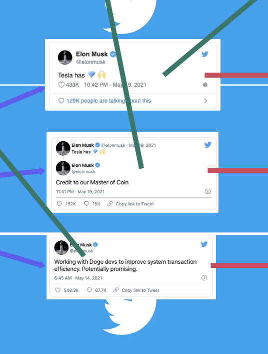

# Crypto Investment Bot using Python

- A single twee can crash the market
- Someone like Elon Musk Has too much power

[https://twitter.com/elonmusk/status/1395027147161489412?ref_src=twsrc%5Etfw">May](https://twitter.com/elonmusk/status/1395027147161489412?ref_src=twsrc%5Etfw">May)

- Diamonds

<Show more Elon Tweets>

- We need to know what he is thinking
- I want to invest based on signals, looking signals from ELON!

Workflow of my investment bot

[https://whimsical.com/investment-bot-using-python-BVRT1mcKwgrU4GM2mSNW9H](https://whimsical.com/investment-bot-using-python-BVRT1mcKwgrU4GM2mSNW9H)

# Coding My investment Bot

## Step 1:Reading signal from the internet

- These signals can be anything ranging from tweets, news articles, or any social media posts
    - Twitter



- Hacker News


- Subreddit groups


- News


- Right now I will start from only looking twitter signals, and eventually improve this bot by adding more sources

- To read twitter signals - [tweepy](https://www.tweepy.org/)

### Source Code Twitter reading Elon's tweets

```python
# %%
import tweepy
import traceback
import pandas as pd
import keys as k

# %%
auth = tweepy.OAuthHandler(k.CONSUMER_KEY, k.CONSUMER_SECRET)
auth.set_access_token(k.ACCESS_TOKEN, k.ACCESS_TOKEN_SECRET)

api = tweepy.API(auth)

# %%
def user_timeline(user_id,tweet_limit):
    """
    Get tweets of user
    """
    try:
        pages_count = int(tweet_limit)/k.TWEETS_PER_PAGE
        new_tweets = tweepy.Cursor(api.user_timeline,screen_name=user_id).pages(pages_count)
        return new_tweets
    except tweepy.TweepError as err:
        raise Exception(traceback.format_exc())
# %%
def fetch_twitter_account_posts(user_id,limit):
    all_tweets = []
    page_cursor = user_timeline(user_id, limit)
    for page in page_cursor:
        for tweet in page:
            all_tweets.append(tweet._json)
    return pd.DataFrame(all_tweets)
# %%
latest_tweets = fetch_twitter_account_posts('elonmusk',100)
```

- Output


## Step 2:Automating buying coins

### Kraken Exchange


**What is a Crypto Exchange?**

[https://en.wikipedia.org/wiki/Cryptocurrency_exchange](https://en.wikipedia.org/wiki/Cryptocurrency_exchange)

A cryptocurrency exchange, or a digital currency exchange (DCE), is a business that allows customers to **trade cryptocurrencies or digital currencies for other assets, such as conventional fiat money or other digital currencies.** Exchanges may **accept credit card payments, wire transfers or other forms of payment** in exchange for digital currencies or cryptocurrencies

**Best Crypto Exchanges**

[Best Crypto Exchanges For 2021](https://www.forbes.com/advisor/investing/best-crypto-exchanges/)

**Different Currencies**
[https://www.coingecko.com/en](https://www.coingecko.com/en)

**Kraken APIs**